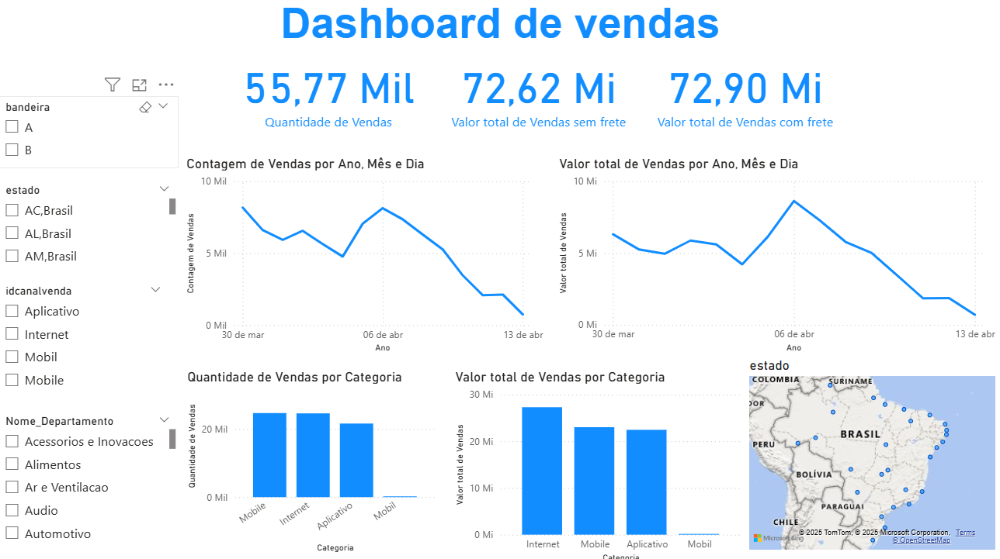
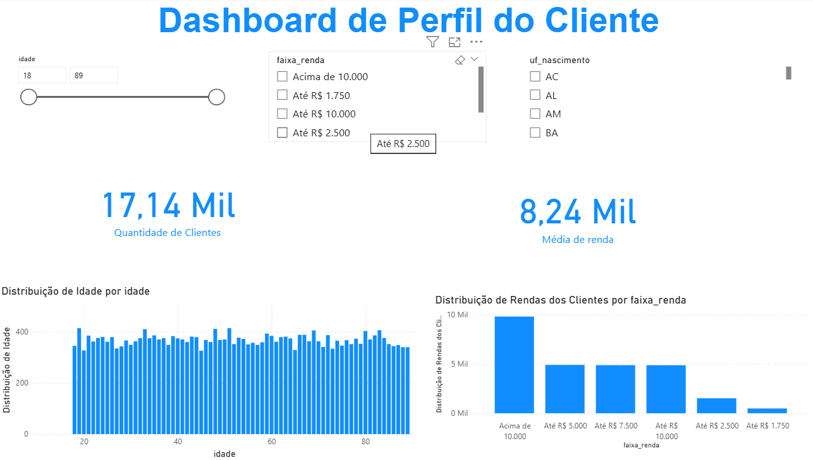

# 📊 Dashboard de Vendas e Perfil de Clientes  

Este repositório contém um dashboard interativo desenvolvido no **Power BI**, com foco na **análise de vendas** e no **perfil dos clientes**.  
O projeto faz parte de um desafio de **Análise de Dados** e tem como objetivo aplicar conceitos de modelagem, DAX e criação de visualizações estratégicas.

✨ Resultado: obtive **nota máxima** no desafio do **Curso de Analista de BI**.  
---

## 🚀 Tecnologias Utilizadas
- **Power BI Desktop**
- **DAX (Data Analysis Expressions)**
- **Modelagem de Dados**
- **ETL (Extração, Transformação e Carga)**

---

## 📂 Estrutura do Repositório
- `dashboard vendas clientes.pbix` → Arquivo principal do dashboard (pode ser aberto no **Power BI Desktop**)  
- `Vendas.png/` → Imagem do dashboard de Vendas
-  `Cliente.png/` → Imagem do dashboard do Perfil dos Clientes

---

## 📈 Relatórios 

### 🔹 Dashboard de Vendas

---

### 🔹 Dashboard do Perfil dos Clientes

---

## 🔎 Como Utilizar
1. Baixe o arquivo `dashboard vendas clientes.pbix`  
2. Abra no **Power BI Desktop**  
3. Explore os relatórios de forma interativa  

---

✍️ Desenvolvido por **Patrícia Rocha**
